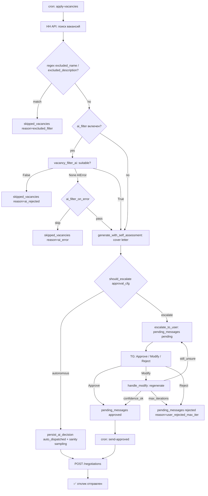
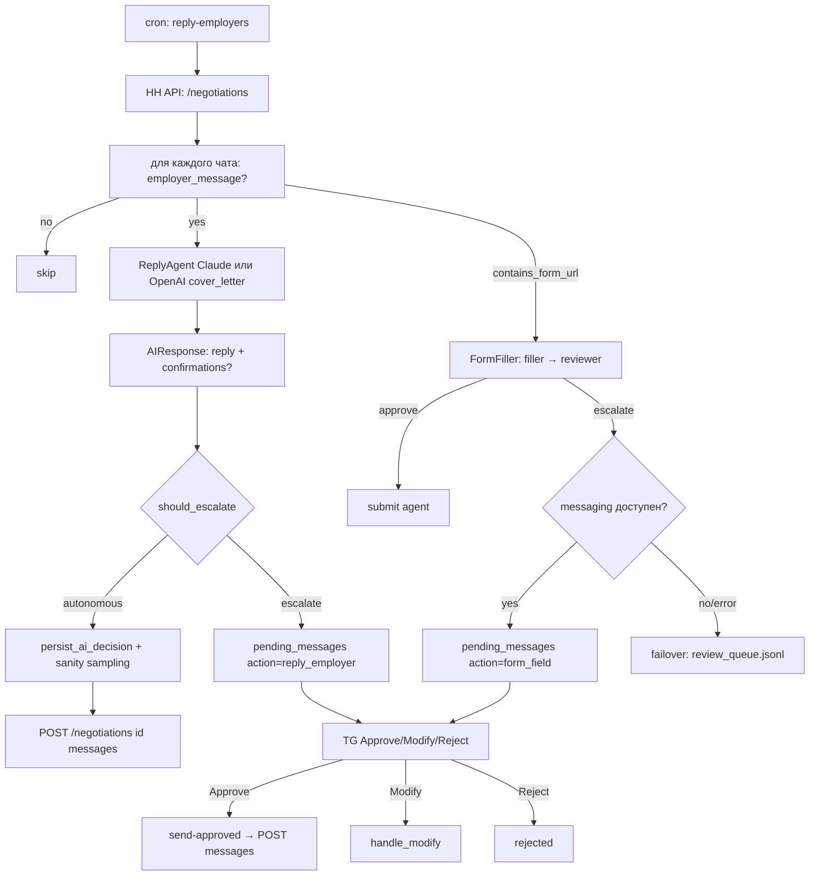
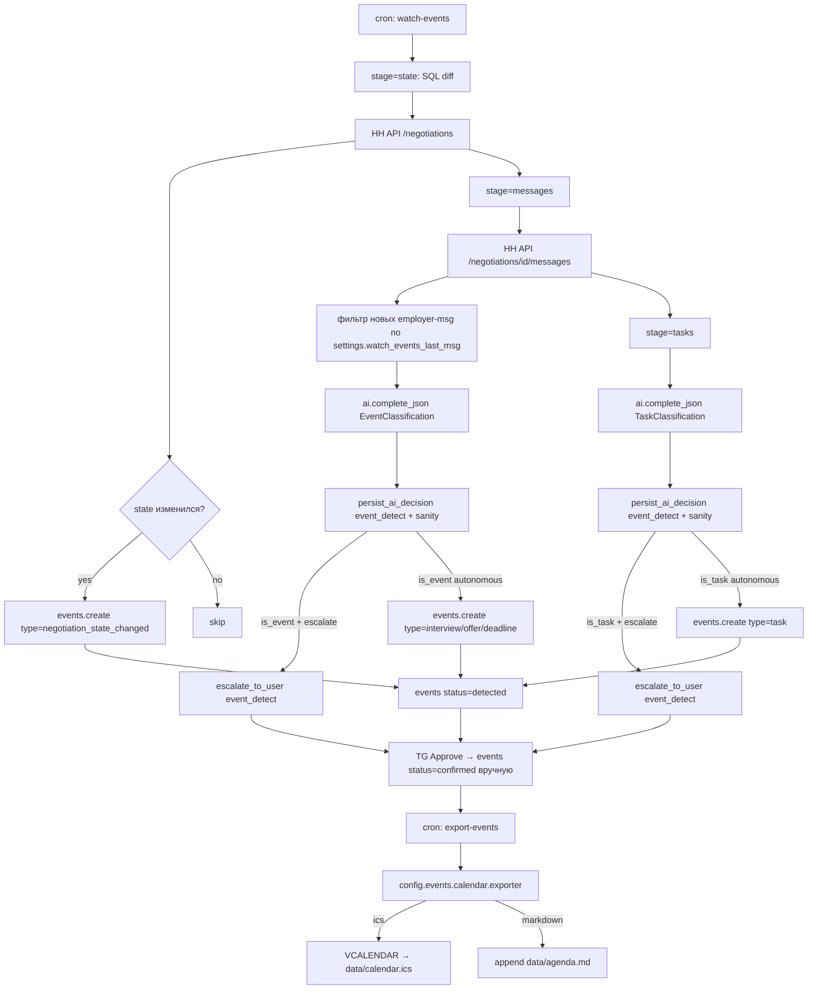

# Agent flow

Как работает hh-applicant-tool после рефакторинга sprint/agent-rework-2026-04-17.

Три потока — `apply-vacancies`, `reply-employers` и `watch-events` —
каждый принимает решение автономно или эскалирует человеку в Telegram.
Вся синхронизация между cron-сервисами и мессенджер-ботом идёт через
SQLite (`pending_messages` / `ai_decisions` / `events`).

## 1. apply-vacancies

Ключевые таблицы:
- `pending_messages` — очередь действий, ждущих approval.
- `ai_decisions` — audit-лог каждого AI-решения (`status`, `confidence`,
  `is_sentinel`, `sample_for_review`, `flagged`).
- `skipped_vacancies` — отфильтрованные вакансии с причиной (`excluded_filter`,
  `ai_rejected`, `ai_error`, `test_no_strategy`, `user_rejected`,
  `user_rejected_max_iter`).

## 2. reply-employers + form-filler с failover в jsonl

FormFiller failover: при ЛЮБОЙ ошибке в messaging-пути (нет storage/factory,
`pending_messages.create` упал, `send_approval_request` упал, messenger=None)
форма пишется в `data/review_queue.jsonl` через старый `append_confirmation`,
чтобы не потерять данные.

## 3. watch-events (три стадии) → events → export_events

Параметры в `config.events`: `watch_interval_minutes` (дефолт 15),
`timezone` (дефолт Europe/Moscow), `calendar.exporter` (ics|markdown),
`calendar.output_path`.

## Config-секции (сводно)

| Секция | Default helper | Назначение |
|--------|----------------|------------|
| `approval` | `get_approval_defaults()` | mode (never/on_escalation/always), confidence_threshold (0.7), always_escalate_actions, max_iterations (3), sanity_frequency (20) |
| `messaging` | `get_messaging_cfg()` | backend (telegram), telegram: bot_token/chat_id/allowed_user_id |
| `persona` | `get_persona_cfg()` | path, source_reports_dir |
| `events` | `get_events_cfg()` | watch_interval_minutes, timezone, calendar: exporter, output_path |

## Переменные окружения

- `HH_PROFILE_ID` — переключение профиля (для dev / prod изоляции).
- `CONFIG_DIR` — путь до config-каталога (дефолт `/app/config` в Docker).
- `OPENAI_PROXY` / `HH_PROXY` — прокси для сетевых вызовов.

## CLI-команды, появившиеся в этом рефакторинге

- `generate-persona --source /app/okami-reports` — разовая генерация persona.md.
- `run-messenger-bot` (alias `messenger-bot`, `bot`) — long-running Telegram-бот.
- `send-approved` (alias `dispatch`) — диспатч approved pending_messages в hh.ru.
- `watch-events --stage {state,messages,tasks,all}` — детектор событий.
- `export-events --format {ics,markdown}` — экспорт confirmed-events.
- `migrate-db` автоматически применяет новые миграции (`pending_messages`,
  `ai_decisions`, `events`).
